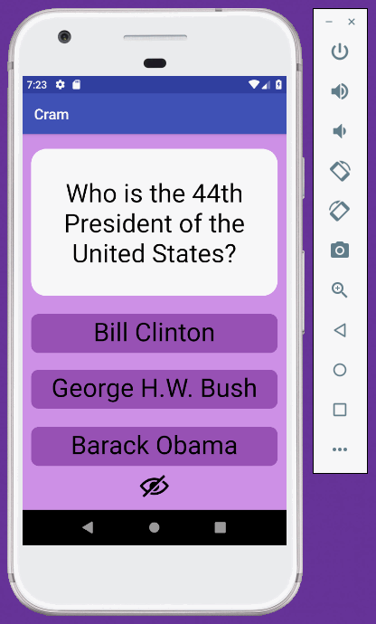

## Cram

### App Description
Cram is a flashcard application that has toggling answer features, front and back ends of each flashcard, and indicates the right or wrong answer when an option is chosen.

### App Walk-Through
 

## Required
- [x] Create new project in Android Studio
- [x] Add a view for the front side of the flashcard to display the question
- [x] Add a view for the back side of the flashcard to display the answer
- [x] Build in logic to show the answer side when the card is tapped
- [x] Push code to GitHub

## Optional
- [x] Toggle the flashcard between the question side and the answer side
- [x] Style the question and answer side of the card to better distinguish between the two sides
- [x] Add selectable multiple choice answers beneath the card
   - [x] Change the background color of the multiple choice answers when clicked to indicate whether the question was answered correctly
- [x] Further customize and style the card
